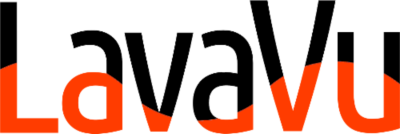
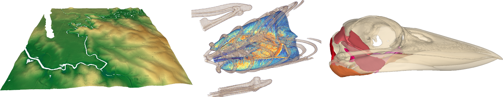

.. lavavu documentation master file

A lightweight scientific visualisation tool with a python interface for fast and flexible visual analysis.

LavaVu provides access to OpenGL powered 3D rendering of point, line, surface and volume data with minimal setup and an interface focused on simple mapping of values to visual properties while abstracting all the intricacies of OpenGL.

LavaVu development is supported by `ACCESS-NRI <https://www.access-nri.org.au/>`__.
Prior development was funded by the Monash Immersive Visualisation Plaform at `Monash eResearch <https://www.monash.edu/researchinfrastructure/eresearch>`__ and the Simulation, Analysis & Modelling component of the `NCRIS
AuScope <http://www.auscope.org.au/simulation-analysis-modelling>`__ capability.

.. toctree::
    :hidden:
    :maxdepth: 3

    Installation <Installation>
    Python Tutorials <Tutorials>

    Property Reference <Property-Reference>
    Scripting Commands Reference <Scripting-Commands-Reference>

    API Reference: lavavu <lavavu>
    API Reference: control <control>
    API Reference: convert <convert>
    API Reference: points <points>
    API Reference: tracers <tracers>

    Interaction with keyboard/mouse <Interaction>
    Running from command Line <Commandline-Arguments>
    Setting Properties <Setting-Properties>
    GLDB File Format <GLDB-file-format>

    LavaVu Github <https://github.com/lavavu/LavaVu>
    LavaVu Wiki   <https://github.com/lavavu/LavaVu/wiki>
    LavaVu Issue Tracker   <https://github.com/lavavu/LavaVu/issues>

.. image:: https://github.com/lavavu/LavaVu/workflows/Test/badge.svg
    :target: https://github.com/lavavu/LavaVu/actions?query=workflow:Test

.. image:: https://github.com/lavavu/LavaVu/workflows/Deploy/badge.svg?branch=1.7.3
    :target: https://github.com/lavavu/LavaVu/actions?query=workflow:Deploy

.. image:: https://zenodo.org/badge/DOI/10.5281/zenodo.2585377.svg
   :target: https://doi.org/10.5281/zenodo.2585377

Introduction
~~~~~~~~~~~~

Originally a set of tools for visualising geodynamics simulations on HPC facilities without GPU access (in the gLucifer [#]_ framework, part of the `Underworld2 <https://github.com/underworldcode/underworld2/>`__ geodynamics simulation code).

LavaVu is now a separate library and general purpose visualisation tool..

LavaVu provides the rendering library for creating 2d and 3d
visualisations to view this sampled data, inline within interactive
Jupyter notebooks and offline through saved visualisation databases and
images/movies.

As a standalone tool it is a scriptable 3D visualisation tool capable of
producing publication quality high res images and video output from time
varying data sets along with HTML5 3D visualisations in WebGL. Rendering
features include correctly and efficiently rendering large numbers of
opaque and transparent points and surfaces and volume rendering by GPU
ray-marching. There are also features for drawing vector fields and
tracers (streamlines).

Control is via python and a set of simple verbose scripting commands
along with mouse/keyboard interaction. GUI components can be generated
for use from a web browser via the python “control” module and a built
in web server.

Widgets for interactive use in the Jupyter notebook environment allow
use for remote visualisation, eg: on supercomputing environments.

A native data format called GLDB is used to store and visualisations in
a compact single file, using SQLite for storage and fast loading. A
small number of other data formats are supported for import (OBJ
surfaces, TIFF stacks etc). Further data import formats are supported
with python scripts, with the numpy interface allowing rapid loading and
manipulation of data.

How do I get started?
~~~~~~~~~~~~~~~~~~~~~

See :doc:`Installation`

Then to get started with the python API :doc:`tutorials/QuickStart`

The core of LavaVu is an OpenGL powered rendering engine written in C++,
this library is accessible via the python API with interactive output in Jupyter notebooks or
as a standalone application

Some of the documentation applies primarily to the standalone viewer application,
but much of the content is still applicable when using via the python API.

Most important for both use cases is the :doc:`Properties reference <Property-Reference>`, these are values that can be changed globally or per object to modify the rendering parameters.

The :doc:`Scripting Commands <Scripting-Commands-Reference>` reference also still applies to the python API,
but it has many more commands available through python functions that are not available to the standalone Viewer.

In python : all the properties available on the Viewer and Objects can be set in python using a dictionary style interface:

::
  
  lv = lavavu.Viewer()
  lv["background"] = "grey"

  pts = lv.points()
  pts["pointsize"] = 10

All the scripting commands can be run by calling them as functions on the Viewer object:

::
  
  lv.rotate('x', 45)
  lv.export()

For more information on the python and IPython interface, see

- :doc:`Tutorials/`
- :doc:`LavaVu Python API Reference <lavavu>`

For more information on using the standalone viewer, see

- :doc:`Interaction with keyboard/mouse <Interaction>`
- :doc:`Running from command Line <Commandline-Arguments>`
- :doc:`Setting Properties <Setting-Properties>`
   

Who do I talk to?
~~~~~~~~~~~~~~~~~

-  Report bugs or request help on the github issue tracker:
   https://github.com/lavavu/LavaVu/issues
-  Contact developers: Owen Kaluza (at) anu.edu.au

Included libraries
~~~~~~~~~~~~~~~~~~

In order to avoid as many external dependencies as possible, the LavaVu
sources include files from the following public domain or open source
libraries, many thanks to the authors for making their code available!

- SQLite3 https://www.sqlite.org
- JSON for Modern C++ https://github.com/nlohmann/json
- Tiny OBJ Loader https://github.com/syoyo/tinyobjloader
- LodePNG https://github.com/lvandeve/lodepng
- jpeg-compressor https://github.com/richgel999/jpeg-compressor
- miniz https://github.com/richgel999/miniz
- GPU Cubic B-Spline Interpolation (optional) in volume shader http://www.dannyruijters.nl/cubicinterpolation/ [#]_

Citation
~~~~~~~~
If you use LavaVu in any published work we would appreciate a citation of the code using the zenodo DOI. There is a master DOI for all releases and releases after 1.3.2 are automatically given a DOI under the master.

.. image:: https://zenodo.org/badge/DOI/10.5281/zenodo.2585376.svg
   :target: https://doi.org/10.5281/zenodo.2585376

--------------

.. [#] `Stegman, D.R., Moresi, L., Turnbull, R., Giordani, J., Sunter, P.,
  Lo, A. and S. Quenette, gLucifer: Next Generation Visualization
  Framework for High performance computational geodynamics, 2008, Visual
  Geosciences <http://dx.doi.org/10.1007/s10069-008-0010-2>`__
.. [#] `Ruijters, Daniel & ter Haar Romeny, Bart & Suetens, Paul. (2008).
  Efficient GPU-Based Texture Interpolation using Uniform B-Splines. J.
  Graphics Tools. 13.
  61-69. <http://dx.doi.org/10.1080/2151237X.2008.10129269>`__

